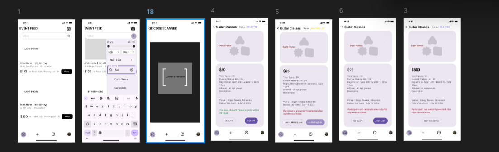
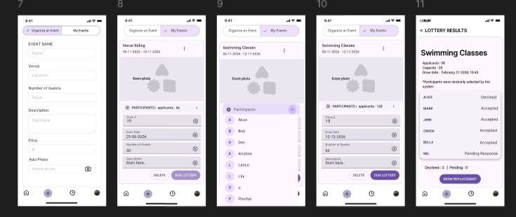
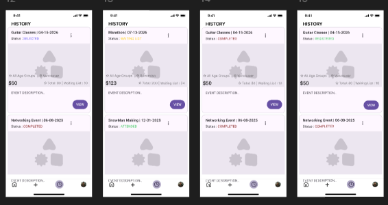
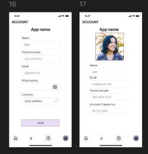

# Storyboard Sequences – Event Lottery System

The mockups illustrate individual screens of the application.
These storyboard sequences describe how users move through the system and how the application responds to their actions.

Each storyboard shows a complete user interaction flow from start to finish.

---

## 1. Browsing Events and Viewing Details

The user opens the application and is presented with the **Event Feed** showing available events.
The system retrieves event information from the database and displays titles, prices, and summaries.

The user can search or filter events to find relevant activities.

When the user selects an event, the system opens the **Event Details** page showing the description, price, and registration information.

If a QR code is scanned, the application routes the user directly to the same event details screen.

**System behaviour:**

* Load events from database
* Display event summaries
* Open detailed event page on selection

**userstroies covered:** R2, R3, R4, R16, R17

## 2. Joining the Waiting List

After reviewing the event information, the user chooses to join the event.

The user presses "Join Waiting List".
The system creates an application entry and adds the user to the event pool.

If geolocation verification is enabled, the system checks the device location before confirming the request.

The interface updates to indicate the user is now on the waiting list.

**System behaviour:**

* Create application record
* Store user in waiting list
* Verify location if required
* Update status to waiting list

**userstories covered:** R5, R6, R7, R19

## 3. Organizer Creates Event and Runs Lottery

An organizer creates a new event by entering the name, venue, capacity, and uploading a poster.

The system saves the event and publishes it to the event feed so entrants can apply.

The organizer can view the list of applicants and monitor participation.

When registration closes, the organizer selects "Run Lottery".
The system randomly selects participants up to the event capacity.

If selected users decline, the organizer draws replacement participants from the remaining pool.

**System behaviour:**

* Store event information
* Display applicant list
* Randomly select participants
* Replace declined participants

**userstories covered:** R8, R11, R12, R14

## 4. Results, Acceptance, and History

The user checks the application results in their event history.

The system displays whether the user was selected, declined, or waitlisted.

If selected, the user can accept or decline the invitation.

After the event occurs, participation is recorded and the event appears in the user’s history as completed.

**System behaviour:**

* Update application status
* Allow acceptance or decline
* Record attendance
* Display participation history

**userstories covered:** R7, R13, R15, R18
